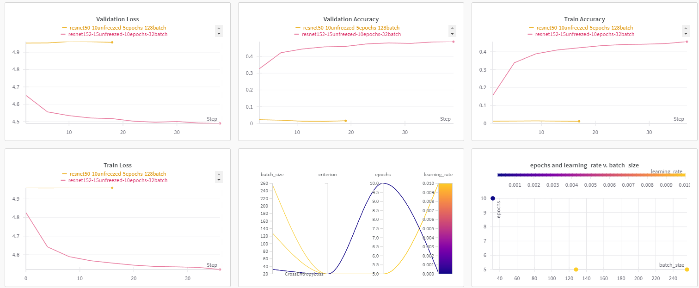

# Pokemon Classifier (1st Generation only)

## Description
This project is a Pokemon classifier that can identify the first generation of Pokemon. The model is trained using transfer learning with a pre-trained ResNet152 model. The dataset used is the **Pokemon-151 dataset** from Kaggle (https://www.kaggle.com/datasets/mikoajkolman/pokemon-images-first-generation17000-files). The model was trained locally and the best model is saved to be used in the Streamlit web application. The web application allows the user to upload an image of a Pokemon and the model will predict the Pokemon's name.

Experiment tracking is done with **Weights and Biases** to monitor the performance of the models and to refine them.


## Installation
To install the required packages, run the following command:
```bash
pip install -r requirements.txt
```

## Usage
To **run the Streamlit web application**, execute the following command:
```bash
streamlit run app.py
```

To **train different models**, modify the transfer-learning-training.ipynb notebook and execute it. Make sure to have a Weights and Biases account to log the experiments and add the **API key** to a .env file.

## The model
The weights of the best model are saved in the **models** folder. The best current model is a ResNet152 model with a final fully connected layer with 143 output units (one for each Pokemon). The model is trained with a learning rate of 0.0001 and a batch size of 32. The model is trained for 10 epochs.
We reach an accuracy of 49%. This may seem a bit low, but the problem to solve was quite challenging. The dataset is very big and we have many output classes. This makes the training time very long and difficult to reach a high accuracy without a NVIDIA GPU, like it was the case.
The best model took 23 hours and 27 minutes in total using a Lenovo with an AMD ryzen 7 5000U and 16GB of RAM.
Other models that were trained were:
- ResNet50: for 5 epoch with 15 unfreeze layers and a learning rate of 0.01
- Two CNNs from scratch on Google collab using the GPU of the pro option, this was too costly and after spending all the resources of the 12 euro program, the model was at the 27th epoch and the accuracy was 0.37 when it crashed because of the lack of resources.

**Note**:
This weights are used in the Streamlit web application to predict the Pokemon's name but those uploaded to the repository are not the correct ones due to the size of the model and the limitations of GitHub. Please contact me if you want to have access to the correct weights 
```
202312401@alu.icai.comillas.edu
```